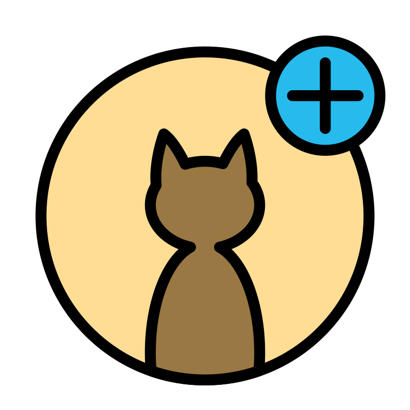

<a name="readme-top"></a>

[![Contributors][contributors-shield]][contributors-url]
[![Forks][forks-shield]][forks-url]
[![Stargazers][stars-shield]][stars-url]
[![Issues][issues-shield]][issues-url]
[![MIT License][license-shield]][license-url]
[![LinkedIn][linkedin-shield]][linkedin-url]

<!-- PROJECT LOGO -->
<br />
<div align="center">
  <a href="https://github.com/MateuszKrolik/Kotlin_Spring_Cat_Facts_Web_App_BackEnd">
    
  </a>

<h3 align="center">Kotlin_Spring_Cat_Facts_Web_App_BackEnd</h3>
  <p align="center">
    <br />
    <a href="https://github.com/MateuszKrolik/Kotlin_Spring_Cat_Facts_Web_App_BackEnd"><strong>Explore the docs »</strong></a>
    <br />
    <br />
    <a href="https://github.com/MateuszKrolik/Kotlin_Spring_Cat_Facts_Web_App_BackEnd">View Demo</a>
    ·
    <a href="https://github.com/MateuszKrolik/Kotlin_Spring_Cat_Facts_Web_App_BackEnd/issues">Report Bug</a>
    ·
    <a href="https://github.com/MateuszKrolik/Kotlin_Spring_Cat_Facts_Web_App_BackEnd/issues">Request Feature</a>
  </p>
</div>

<!-- TABLE OF CONTENTS -->
<details>
  <summary>Table of Contents</summary>
  <ol>
    <li>
      <a href="#about-the-project">About The Project</a>
      <ul>
        <li><a href="#built-with">Built With</a></li>
      </ul>
    </li>
    <li>
      <ul>
        <li><a href="#installation">Installation</a></li>
      </ul>
    </li>
    <li><a href="#roadmap">Roadmap</a></li>
    <li><a href="#contributing">Contributing</a></li>
    <li><a href="#license">License</a></li>
    <li><a href="#contact">Contact</a></li>
    <li><a href="#acknowledgments">Acknowledgments</a></li>
  </ol>
</details>

<!-- ABOUT THE PROJECT -->

### Look at below video to see the RESTful API in Action 😉 

https://github.com/user-attachments/assets/9d22dac7-66e5-41fe-8336-9f7a3d7b9a48

### Built With

<!-- Programming Languages -->

- [![Kotlin][Kotlin]][Kotlin-url]
- [![Java][Java]][Java-url]

<!-- Web Technologies -->

- [![Spring][Spring]][Spring-url]
- [![Spring Boot][Spring Boot]][Spring Boot-url]
- [![Gradle][Gradle]][Gradle-url]

<!-- OS -->

- [![Linux/Unix][Linux/Unix]][Linux/Unix-url]

<!-- Data Formats -->

- [![YAML][YAML]][YAML-url]
- [![JSON][JSON]][JSON-url]
- [![.env][.env]][.env-url]

<!-- IDEs and Editors -->

- [![IntelliJ][IntelliJ]][IntelliJ-url]

<p align="right">(<a href="#readme-top">back to top</a>)</p>

<!-- GETTING STARTED -->

### Installation

1. Clone the repo

```sh
git clone https://github.com/MateuszKrolik/Kotlin_Spring_Cat_Facts_Web_App_BackEnd.git
```

<p align="right">(<a href="#readme-top">back to top</a>)</p>

<!-- ROADMAP -->

## Roadmap

- [x] Monolithic Architecture
- [x] Containerization via Docker and Docker-Compose
- [x] Constructor-based Dependency Injection and Bean AutoWiring using Spring Framework
- [x] Starter-Projects and Auto-Configuration using Spring Boot Framework
- [x] CORS
- [x] Reactive Programming via:
  - [x] Kotlin's Flow API
  - [x] Spring WebFlux
- [x] Best Practices such as:
  - [x] Repository Design Pattern
  - [x] Loose-Coupling via Interfaces
  - [x] Modularization
  - [x] DTO's via Kotlin's DataClasses and Jackson Library
  - [x] Environment Variables with FallBack values for Local Development
  - [x] Centralized Configuration
  - [x] Global Exception Handling

See the [open issues](https://github.com/MateuszKrolik/Kotlin_Spring_Cat_Facts_Web_App_BackEnd/issues) for a full list of proposed features (and known issues).

<p align="right">(<a href="#readme-top">back to top</a>)</p>

<!-- CONTRIBUTING -->

## Contributing

Contributions are what make the open source community such an amazing place to learn, inspire, and create. Any contributions you make are **greatly appreciated**.

If you have a suggestion that would make this better, please fork the repo and create a pull request. You can also simply open an issue with the tag "enhancement".
Don't forget to give the project a star! Thanks again!

1. Fork the Project
2. Create your Feature Branch (`git checkout -b feature/AmazingFeature`)
3. Commit your Changes (`git commit -m 'Add some AmazingFeature'`)
4. Push to the Branch (`git push origin feature/AmazingFeature`)
5. Open a Pull Request

<p align="right">(<a href="#readme-top">back to top</a>)</p>

<!-- LICENSE -->

## License

Distributed under the MIT License. See `LICENSE` for more information.

<p align="right">(<a href="#readme-top">back to top</a>)</p>

<!-- CONTACT -->

## Contact

Mateusz Królik - [Mateusz Królik](https://www.linkedin.com/in/mateusz-kr%C3%B3lik-8b1862262/) - [mateuszkrolik87@gmail.com](mailto:mateuszkrolik7@gmail.com)

GitHub Repository Link: [GitHub Repository Link](https://github.com/MateuszKrolik/Kotlin_Spring_Cat_Facts_Web_App_BackEnd)

<p align="right">(<a href="#readme-top">back to top</a>)</p>

<!-- ACKNOWLEDGMENTS -->

## Acknowledgments

- [Img Shields](https://shields.io)
- [GitHub Emoji Cheat Sheet](https://www.webpagefx.com/tools/emoji-cheat-sheet)
- [Malven's Flexbox Cheatsheet](https://flexbox.malven.co/)
- [Malven's Grid Cheatsheet](https://grid.malven.co/)
- [SVG Repo](https://www.svgrepo.com/)

<p align="right">(<a href="#readme-top">back to top</a>)</p>

<!-- MARKDOWN LINKS & IMAGES -->
<!-- https://www.markdownguide.org/basic-syntax/#reference-style-links -->

[contributors-shield]: https://img.shields.io/github/contributors/MateuszKrolik/Kotlin_Spring_Cat_Facts_Web_App_BackEnd.svg?style=for-the-badge
[contributors-url]: https://github.com/MateuszKrolik/Kotlin_Spring_Cat_Facts_Web_App_BackEnd/graphs/contributors
[forks-shield]: https://img.shields.io/github/forks/MateuszKrolik/Kotlin_Spring_Cat_Facts_Web_App_BackEnd.svg?style=for-the-badge
[forks-url]: https://github.com/MateuszKrolik/Kotlin_Spring_Cat_Facts_Web_App_BackEnd/network/members
[stars-shield]: https://img.shields.io/github/stars/MateuszKrolik/Kotlin_Spring_Cat_Facts_Web_App_BackEnd.svg?style=for-the-badge
[stars-url]: https://github.com/MateuszKrolik/Kotlin_Spring_Cat_Facts_Web_App_BackEnd/stargazers
[issues-shield]: https://img.shields.io/github/issues/MateuszKrolik/Kotlin_Spring_Cat_Facts_Web_App_BackEnd.svg?style=for-the-badge
[issues-url]: https://github.com/MateuszKrolik/Kotlin_Spring_Cat_Facts_Web_App_BackEnd/issues
[license-shield]: https://img.shields.io/github/license/MateuszKrolik/Kotlin_Spring_Cat_Facts_Web_App_BackEnd.svg?style=for-the-badge
[license-url]: https://github.com/MateuszKrolik/Kotlin_Spring_Cat_Facts_Web_App_BackEnd/blob/master/LICENSE
[linkedin-shield]: https://img.shields.io/badge/-LinkedIn-black.svg?style=for-the-badge&logo=linkedin&colorB=555
[linkedin-url]: https://linkedin.com/in/mateusz-królik-8b1862262
[Java-url]: https://www.oracle.com/java/
[Java]: https://img.shields.io/badge/Java-ED8B00?style=for-the-badge&logo=openjdk&logoColor=white
[Kotlin]: https://img.shields.io/badge/Kotlin-0095D5?style=for-the-badge&logo=kotlin&logoColor=white
[Kotlin-url]: https://kotlinlang.org/
[Spring]: https://img.shields.io/badge/Spring-6DB33F?style=for-the-badge&logo=spring&logoColor=white
[Spring-url]: https://spring.io/
[Spring Boot]: https://img.shields.io/badge/Spring_Boot-6DB33F?style=for-the-badge&logo=spring-boot&logoColor=white
[Spring Boot-url]: https://spring.io/projects/spring-boot
[Gradle]: https://img.shields.io/badge/Gradle-02303A?style=for-the-badge&logo=gradle&logoColor=white
[Gradle-url]: https://gradle.org/
[Linux/Unix]: https://img.shields.io/badge/Linux-FCC624?style=for-the-badge&logo=linux&logoColor=black
[Linux/Unix-url]: https://www.linux.org/
[YAML]: https://img.shields.io/badge/YAML-000000?style=for-the-badge&logo=yaml&logoColor=white
[YAML-url]: https://yaml.org/
[JSON]: https://img.shields.io/badge/JSON-000000?style=for-the-badge&logo=json&logoColor=white
[JSON-url]: https://www.json.org/
[.env]: https://img.shields.io/badge/.env-ECD53F?style=for-the-badge&logo=dotenv&logoColor=black
[.env-url]: https://dotenv.org/
[IntelliJ]: https://img.shields.io/badge/IntelliJ_IDEA-000000?style=for-the-badge&logo=intellij-idea&logoColor=white
[IntelliJ-url]: https://www.jetbrains.com/idea/
